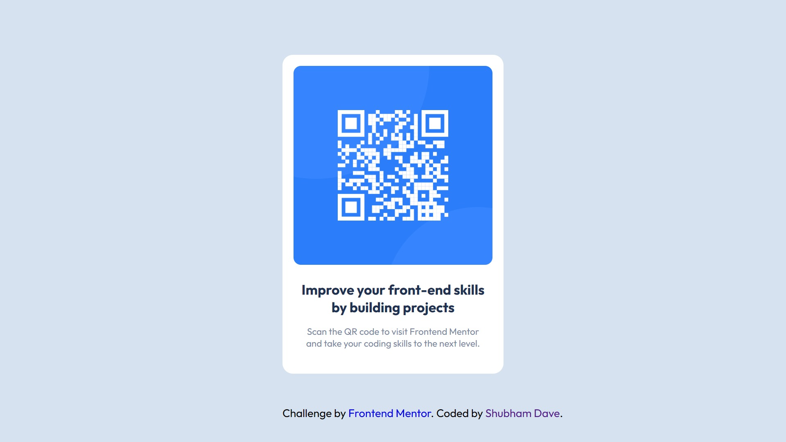

# Frontend Mentor - QR code component solution

This is a solution to the [QR code component challenge on Frontend Mentor](https://www.frontendmentor.io/challenges/qr-code-component-iux_sIO_H). Frontend Mentor challenges help you improve your coding skills by building realistic projects. 

## Table of contents

- [Overview](#overview)
  - [Screenshot](#screenshot)
  - [Links](#links)
- [My process](#my-process)
  - [Built with](#built-with)
  - [What I learned](#what-i-learned)
  - [Useful resources](#useful-resources)
- [Author](#author)


## Overview

### Screenshot



### Links

- Solution URL: [Github Repository](https://github.com/shaayar/Front-End-Mentor)

## My process

### Built with

- HTML5 markup
- CSS 
  - Flexbox properties


### What I learned

There are multiple ways in css to center a div tag, like using the display property, applying padding or margin to div, etc. Here I learned how to center a div tag through margin property in css.

For the code of margin property, see below:
```css
div {
  margin: 0 auto;
}
```
As we apply the above code to any div tag, the div gets the upper and lower margins as '0'
and left and right margin as 'auto'.

### Useful resources

- [QR Code Component | Frontend Mentor Challenge](https://youtu.be/5BBYPntB-GY?si=qyVwFgIm0db5wCVZ) - This helped me for understanding the margin property a bit better. And I also got some knowledge on how to write the code in a proper format through observing the coding pattern. I will use the pattern on going forward in  further projects.

## Author

<!-- - Website - [Shubham Dave](https://coderboi.carrd.co) -->
- Frontend Mentor - [@yourusername](https://www.frontendmentor.io/profile/shaayar)
- Linked In - [Shubham Dave](https://linkedin.com/in/shubham-dave-369682249?utm_source=share&utm_campaign=share_via&utm_content=profile)